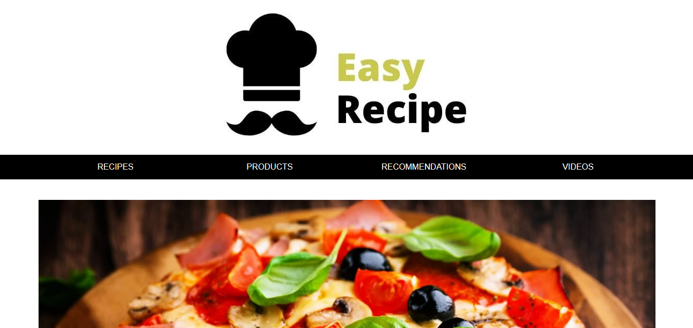
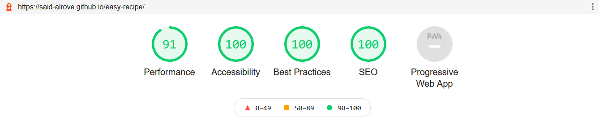
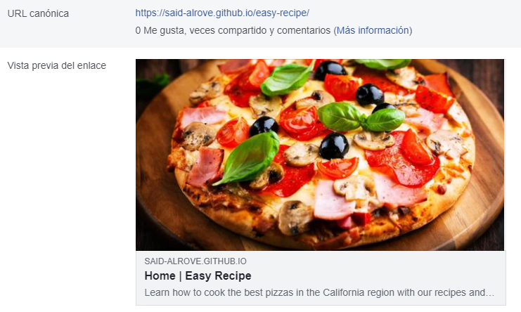
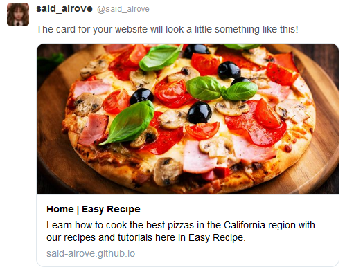

# easy-recipe
The fifth project from Juan Pablo's course of CSS Grid and Flexbox.

## Project's preview

## What I learned
This was an easy project to practice my knowledge in Grid and Flexbox (Grid overall).

I learned that I shouldn't add the loading="lazy" property to those images that are already in the user's view (like the logotype or the hero image) because it's useless (there's no point).

A few days ago I watched a video where the YouTuber (Lucas Dalto) said that's more powerful to put our full URL in the meta properties (like prefetch) or other elements that require an URL instead of just putting the local direction ("https://said-alrove.github.io/easy-recipe/index.html" is better than "/index.html"). In like manner we should put the most descriptive information in the alt attributes to have a better SEO.

I figured out that we shouldn't use SVG images for the Open Graph properties due to for any reason they're not rendered (there'll be issues warns in the debuggers).

Something important to add is that we should use images with high definition (at least over 600px) to achieve a higher lighthouse performance.

That'd be everything for this project :D.

### Lighthouse

### Facebook

### Twitter

